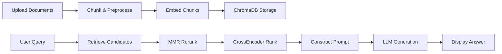

**RAG_Chatbot**

A Retrieval-Augmented Generation (RAG) chatbot built with Python and Streamlit, integrating LangChain, HuggingFace embeddings, and a local vector database (ChromaDB) to deliver precise and context-aware responses from custom documents such as contracts, policies, or any text corpus.

Access the chatbot hosted on Streamlit Cloud : https://docuragchatbot-kngarfajr3kn2wblrvb7kb.streamlit.app/

## 📌 Table of Contents

1. [Project Overview](#project-overview)
2. [Key Features](#key-features)
3. [Architecture & Pipeline](#architecture--pipeline)
4. [Getting Started](#getting-started)

   * [Prerequisites](#prerequisites)
   * [Installation](#installation)
5. [Usage](#usage)
6. [Future Enhancements](#future-enhancements)
7. [Contributing](#contributing)


## 📝 Project Overview

This RAG\_Chatbot leverages the power of large language models (LLMs) combined with a vector retrieval database to answer user queries based on custom document collections. Users can upload PDFs, Word documents, or text files; the system will:

1. **Chunk & Embed**: Break documents into semantic chunks and generate embeddings.
2. **Store**: Save embeddings in ChromaDB for fast similarity search.
3. **Retrieve & Rerank**: On user query, retrieve top-N relevant chunks via MMR, then rerank using CrossEncoder for precision.
4. **Generate**: Compose a final, coherent answer by prompting the LLM with retrieved contexts.
5. **Streamlit UI**: Interactive frontend allowing uploads, chat interface, and session state.


## ✨ Key Features

* **Streamlit-based UI**: Simple, responsive chat interface.
* **Document Ingestion**: Support for PDF, TXT, and DOCX.
* **Chunking Module**: Customizable chunk size & overlap.
* **Embeddings**: HuggingFace sentence-transformers.
* **Vector Store**: ChromaDB with optional persistence.
* **Retrieval**: Maximum Marginal Relevance (MMR) + CrossEncoder re-ranking.
* **Error Handling**: Robust logging, hides stack traces from end-users.


## 🏗 Architecture & Pipeline



## 🚀 Getting Started

### Prerequisites

* Python 3.9+
* pip or poetry
* Git

### Installation

1. **Clone the repository**:

   ```bash
   git clone https://github.com/Adnan-Akil/RAG_Chatbot.git
   cd RAG_Chatbot
   ```

2. **Create & activate virtual environment**:

   ```bash
   python -m venv venv
   source venv/bin/activate   # Linux/Mac
   venv\\Scripts\\activate  # Windows
   ```

3. **Install dependencies**:

   ```bash
   pip install -r requirements.txt
   ```

4. **Setup the API key from GROQ website using any model of choice**


## 💬 Usage

Launch the Streamlit app:

```bash
streamlit run src/app.py
```

* Navigate to `http://localhost:8501`
* Upload documents and start chatting!


## 🔮 Future Enhancements

1. **Extensive Data Analysis Module**:

    **CSV & Excel Support**: Ingest large numeric datasets via `pandas`.
    **Numeric Analytics**: Compute statistics, trends, correlations, and aggregations.
    **Visualization**: Integrate `matplotlib` or `plotly` for charts (line, bar, scatter).
    **Streamlit Components**: Tabs for `Data Overview`, `Summary Statistics`, `Plots`, and `Download Reports`.
2. **Enhanced UI/UX**:

    * Dark/light mode toggle.
    * Custom CSS for branding.
3. **Memory & Context Window**:

    * Store conversation history in vectorDB for long-term context.
4. **Authentication & Security**:

    * User login & permission control.
5. **Multi-Language Support**:

    * Extend to other languages via multilingual embeddings.

## 🤝 Contributing

Contributions welcome! Please follow the standard GitHub flow:

1. Fork the repository
2. Create a new branch (`git checkout -b feature/your-feature`)
3. Commit your changes (`git commit -m 'Add feature'`)
4. Push to the branch (`git push origin feature/your-feature`)
5. Open a Pull Request

## > Built with ❤️ by Adnan Akil.
